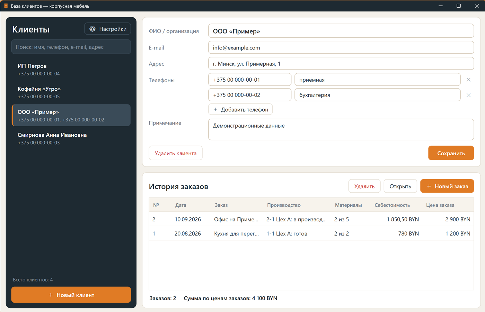
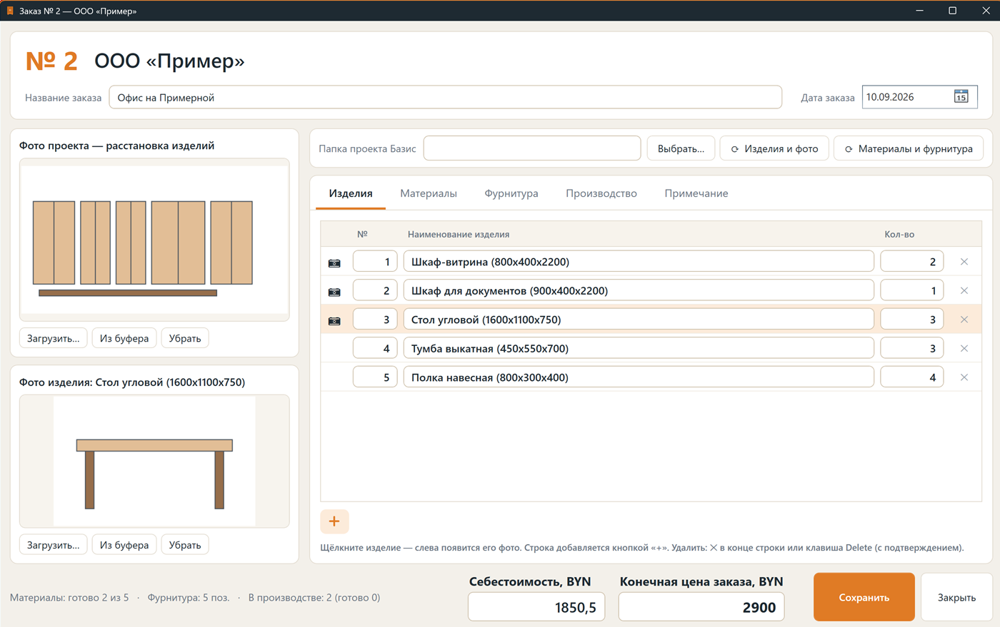
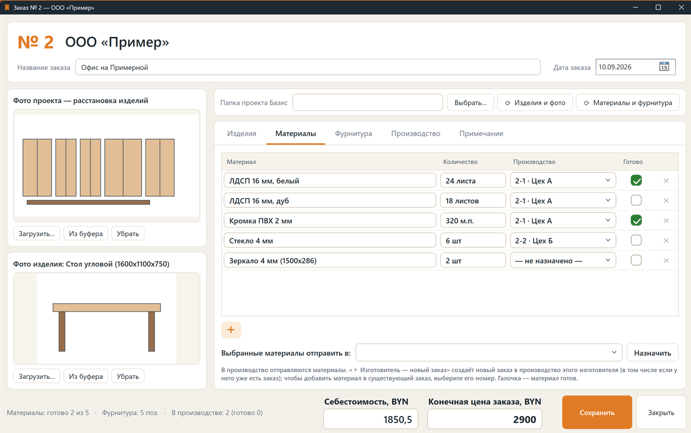
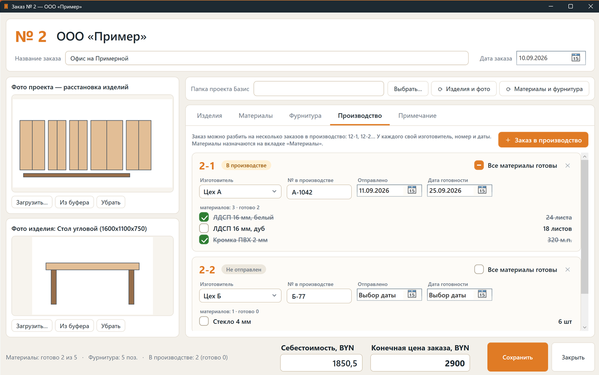

# База клиентов

**Программа для мебельного производства: клиенты, история заказов, изделия с фото, материалы, фурнитура и заказы в производство.**
Работает на Windows, хранит всё на вашем компьютере, ставится обычным установщиком и сама сообщает о новых версиях.



## Возможности

- **Клиенты** — ФИО или организация, несколько телефонов с пометками, e-mail, адрес, примечание; быстрый поиск по любому полю.
- **История заказов** у каждого клиента: номер, дата, название, состояние производства, готовность материалов, себестоимость и конечная цена.
- **Заказ** — общее фото проекта (расстановка изделий) и фото каждого изделия; фото можно загрузить, перетащить или вставить из буфера обмена.
- **Изделия, материалы и фурнитура** — отдельные списки; строки добавляются кнопкой «+», любое удаление — с подтверждением.
- **Заказы в производство** — заказ можно разбить на несколько (12-1, 12-2…): у каждого свой изготовитель, номер в производстве, даты отправки и готовности и список материалов с отметкой «готов». Новый заказ у нужного изготовителя создаётся прямо из списка «Производство».
- **Импорт из Базис-Мебельщика** — изделия с эскизами и общее фото проекта из папки проекта; материалы и фурнитура из таблицы Excel (`.xls` / `.xlsx`).
- **Себестоимость и конечная цена** заказа вводятся вручную.
- **Данные в вашей папке** — база SQLite, фото и ежедневные резервные копии; папку можно перенести на другой диск.
- **Обновление изнутри программы** — проверка раз в сутки и кнопка «Проверить обновления».

<p>
  
  
</p>
<p>
  
</p>

*На скриншотах — вымышленные демонстрационные данные.*

## Установка

1. Откройте [последний релиз](../../releases/latest) и скачайте файл `BazaKlientov-Setup-<версия>.exe` из блока **Assets**.
2. Запустите его и пройдите мастер установки. Права администратора не нужны, ничего дополнительно ставить не требуется
   (внутри уже есть всё необходимое). Подойдёт Windows 10 или 11, 64-разрядная.
3. Запустите «База клиентов» с рабочего стола или из меню «Пуск».

> Установщик не подписан цифровой подписью, поэтому при первом запуске Windows может показать окно
> «Windows защитила ваш компьютер». Нажмите «Подробнее» → «Выполнить в любом случае».

## Обновление

Программа при запуске (не чаще раза в сутки) смотрит, нет ли нового релиза, и предлагает установить его.
Проверить вручную: **Настройки → Проверить обновления**. Новая версия ставится поверх старой, данные не затрагиваются;
перед изменением структуры базы программа сама делает резервную копию.

## Ваши данные

- База, фото и резервные копии лежат в папке `Документы\База клиентов`. Изменить её можно в **Настройки → Изменить папку**
  (данные копируются, старая папка остаётся на месте).
- Программа работает без интернета. Единственное обращение в сеть — проверка новой версии на GitHub; ваши данные
  при этом никуда не отправляются.
- В этом репозитории **нет** никаких данных пользователей — только исходный код.
- Не открывайте одну и ту же базу с двух компьютеров одновременно (особенно из облачной папки): база может повредиться.

## Импорт из Базис-Мебельщика

Программа ищет в выбранной папке проекта:

```
Проект/
├─ 3Д/
│  ├─ Проект.b3d                          общий файл — из него берётся общее фото
│  ├─ Изделия/1) Название (ШхГхВ) 5шт.b3d файлы изделий: «номер) название», «5шт» — количество
│  └─ На раскрой/…                        пропускается
├─ Эскизы/1-1 Название.jpg                эскиз изделия № 1 (первый вид)
└─ Фурник/таблица.xls                     подпись «Материалы» и таблица «Наименование / Ед. изм. / К-во»
```

Положение ячеек в таблице не важно: подпись «Материалы» и заголовки таблицы ищутся по тексту.
Формат `.b3d` закрытый, поэтому из него читается только встроенная миниатюра; количество берётся из «5шт» в имени файла.

## Сборка из исходников

Нужен [.NET 8 SDK](https://dotnet.microsoft.com/download/dotnet/8.0) и Windows.

```powershell
dotnet build -c Release          # сборка
dotnet run -c Release            # запуск (параметр --db <путь> открывает любую другую базу)
```

Установщик (нужен [Inno Setup 6](https://jrsoftware.org/isinfo.php)):

```powershell
powershell -ExecutionPolicy Bypass -File .\build-installer.ps1   # → dist\BazaKlientov-Setup-<версия>.exe
```

Выпуск новой версии: поднять `<Version>` в `ClientBase.csproj`, собрать установщик, выложить его в релиз
(`gh release create vX.Y.Z dist\BazaKlientov-Setup-X.Y.Z.exe`). Программы, установленные ранее, найдут его сами.

## Устройство проекта

| Файл | Назначение |
|---|---|
| `Models.cs` | Модель: клиенты, заказ, изделия, материалы, фурнитура, заказы в производство (без WPF) |
| `Database.cs` | SQLite: схема с версиями (`PRAGMA user_version`), миграции, сохранение и загрузка |
| `ProjectImport.cs`, `MaterialImport.cs` | Чтение папок Базис-Мебельщика и таблицы «Фурник» |
| `DataLocation.cs` | Папка данных: настройка, проверка, перенос |
| `Updates.cs`, `UpdateUi.cs`, `DownloadWindow.*` | Проверка и установка обновлений |
| `MainWindow`, `OrderWindow`, `SettingsWindow`, `PhotoBox`, `PhotoViewer` | Окна |
| `Theme.xaml` | Оформление |
| `Installer/ClientBase.iss`, `build-installer.ps1` | Установщик |

Правила: любое удаление — с подтверждением; изменение структуры базы — только новой миграцией в `Database.Init`.

## Автор

Разработка: [cana-surprise](https://github.com/cana-surprise).

## Права

© cana-surprise. Исходный код опубликован для ознакомления. Все права защищены: копирование, изменение и
распространение программы или её кода без разрешения автора не допускаются.
